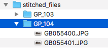

## General Description:

The purpose of this script is to streamline the sitching process alongside uploading data to mapillary's backend systems.
This will allow you to:
- Stitch GoPro images in an automated way
- Upload images to Mapillary

For any issue arising during the installation process, just [submit an issue](https://github.com/lukes3315/mapillary_fusion/issues) and I'll get to it as soon as I can.

## Setup

### Requirements:

#### Note: has only been tested on Mac OS X.

First of all you will need to download and install GoPro fusion, view instructions [here](https://gopro.com/help/articles/how_to/how-to-install-fusion-studio-mac).

Then, confirm you have python installed, open a [terminal](https://blog.teamtreehouse.com/introduction-to-the-mac-os-x-command-line) and type:<br/>
`which python`<br/>
If the output is:<br/>
`/usr/bin/python`<br/>
Or any python available should be good to go.<br/>In case no python is installed, just [download and install it](https://www.python.org/downloads/mac-osx/).<br/>
Easier: if you already have [homebrew](https://brew.sh/) just run:<br/>
`brew install python`

You're almost done, now install [mapillary_tools](https://github.com/mapillary/mapillary_tools/), the main part is just running this:<br/>`pip install --upgrade git+https://github.com/mapillary/mapillary_tools`<br/>Note: that the commands should either be run in [virtualenv](https://virtualenv.pypa.io/en/stable/installation/) or as sudo.

To confirm this has been installed properly verify the `pip` output:

```
Collecting git+https://github.com/mapillary/mapillary_tools
  Cloning https://github.com/mapillary/mapillary_tools to /private/tmp/pip-req-build-pc1F90
Requirement already satisfied, skipping upgrade: exifread==2.1.2 in /Library/Python/2.7/site-packages (from mapillary-tools==0.2.0) (2.1.2)
Requirement already satisfied, skipping upgrade: gpxpy==0.9.8 in /Library/Python/2.7/site-packages (from mapillary-tools==0.2.0) (0.9.8)
Requirement already satisfied, skipping upgrade: Pillow==2.9.0 in /Library/Python/2.7/site-packages (from mapillary-tools==0.2.0) (2.9.0)
Requirement already satisfied, skipping upgrade: python-dateutil==2.7.3 in /Library/Python/2.7/site-packages (from mapillary-tools==0.2.0) (2.7.3)
Requirement already satisfied, skipping upgrade: pymp4==1.1.0 in /Library/Python/2.7/site-packages (from mapillary-tools==0.2.0) (1.1.0)
Requirement already satisfied, skipping upgrade: pynmea2==1.12.0 in /Library/Python/2.7/site-packages (from mapillary-tools==0.2.0) (1.12.0)
Requirement already satisfied, skipping upgrade: pytest==3.2.3 in /Library/Python/2.7/site-packages (from mapillary-tools==0.2.0) (3.2.3)
Requirement already satisfied, skipping upgrade: six>=1.5 in /Library/Python/2.7/site-packages (from python-dateutil==2.7.3->mapillary-tools==0.2.0) (1.11.0)
Requirement already satisfied, skipping upgrade: construct==2.8.8 in /Library/Python/2.7/site-packages (from pymp4==1.1.0->mapillary-tools==0.2.0) (2.8.8)
Requirement already satisfied, skipping upgrade: py>=1.4.33 in /Library/Python/2.7/site-packages (from pytest==3.2.3->mapillary-tools==0.2.0) (1.6.0)
Requirement already satisfied, skipping upgrade: setuptools in /Library/Python/2.7/site-packages (from pytest==3.2.3->mapillary-tools==0.2.0) (40.2.0)
Installing collected packages: mapillary-tools
  Found existing installation: mapillary-tools 0.2.0
    Uninstalling mapillary-tools-0.2.0:
      Successfully uninstalled mapillary-tools-0.2.0
  Running setup.py install for mapillary-tools ... done
Successfully installed mapillary-tools-0.2.0
```
Confirm with the "Successfully" written at the end. All done ! Lets get to it!

## Usage:


### General

The script you will be running is called: `mapillary_processor.py`.<br/>Note the `.py` extension which tells us it's a `python` script.<br/>
Then type:
```
python mapillary_processor.py
```
This will output a help menu:
```
Usage:
--help: show this menu.
--stitch_directory: GoPro root directory that contains images to fuse.
--output_directory: output directory, where your stitched will be stored.
--dwarp: on/off turns on or off d.warp in stitching process (off by default).
--upload_directory: directory containing images to upload to Mapillary's services.
--debug: display debug information from Fusion software.
--user: Your mapillary username, view README (only required for upload procedure).
```

### Stitching

To start stitching GoPro imagery run:
```
python mapillary_processor.py --stitch_directory=gopro_images/ --output_directory=stitched_files/ --dwarp=off
```

The script will automatically recognize GoPro directories, match them up and run the stitching through all the files of the matched
up directories.
This is my directory structure:


Note the directories starting 103 & 104, these are the ones containing my GoPro imagery.
The script will automatically notice this and run the stitching on them.

After having ran the script the output directory should look like this:



There we go! All done! you can just open the images and you'll the beautiful stitched output.

### Uploading

First of all, you need to register on Mapillary's [website](https://mapillary.com/signup), we will need the username they provide to upload data.

Once you have retrieved your username, you can just upload the data with this command line:
```
python mapillary_processor.py --upload_directory=stitched_files --user=mapillary_user
```
This will then prompt you to enter both your email address and password to authenticate with Mapillary's servers:
```
Running user_process for 80 images, skipping 0 images.
Enter user credentials for user mapillary_user :
Enter email : mapillary_user@domain.com
Enter user password :
```

After having running this you should be seeing Mapillary's processing and uploading engines to some work:<br/>
```
Sub process finished
Running import_meta_data_process for 15 images, skipping 65 images.
Sub process finished
Running geotag_process for 15 images, skipping 65 images.
Sub process finished
Running sequence_process for 0 images, skipping 80 images.
Running sequence_process for 42 images, skipping 0 images.
Running sequence_process for 38 images, skipping 0 images.
Sub process finished
Running upload_params_process for 80 images, skipping 0 images.
Sub process finished
Running mapillary_image_description for 80 images, skipping 0 images.
Sub process finished
Process done.
No post processing action specified.
```
If no errors occured you're all good, and it will proceed to the next steps.

And finally the uploads:
```
Uploading 80 images with valid mapillary tags (Skipping 0)
Uploading with 5 threads
Done uploading 80 images.====================================] 100.0% ... 0 images left.
```

All done.

Enjoy!
For any feedback please file an issue [here](https://github.com/lukes3315/mapillary_fusion/issues) and I'll get back to you as soon as I can.
