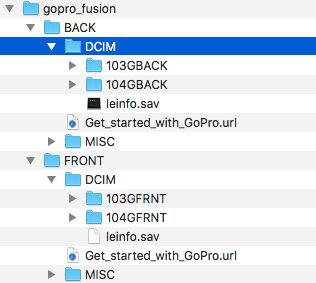

## General Description:

The purpose of this script is to streamline the sitching process alongside uploading data to mapillary's backend systems.
This will allow you to:
- Stitch GoPro images in an automated way
- Upload images to Mapillary

## Setup

### Requirements:

#### Note: has only been tested on Mac OS X.

First of all you will need to download and install GoPro fusion, view instructions [here](https://gopro.com/help/articles/how_to/how-to-install-fusion-studio-mac).
Then confirm you are using [python](https://www.python.org/downloads/mac-osx/) (on Mac OS X it is installed by default), this is the interpretation software that will be running the script.
You may not need to download it, if you open a [terminal](https://blog.teamtreehouse.com/introduction-to-the-mac-os-x-command-line) and type:
`which python`, if the output is: `/usr/bin/python` then you are using the system one and you don't need to install anything else.

### Usage:

The script you will be running is called: `mapillary_processor.py`. Note the `.py` extension which tells us it's a `python` script.
Then type:
`python mapillary_processor.py`
This will output:
```
Usage:
--help: show this menu
--stitch_directory: GoPro root directory that contains images to fuse.
--output_directory: output directory
--dwarp: on/off turns on or off d.warp in stitching process.
--upload_directory: directory containing images to upload to Mapillary's services.
--debug: display debug information from Fusion software.
```

To start stitching GoPro imagery run:
`python mapillary_processor.py --stitch_directory=gopro_images/ --output_directory=stitched_files/ --dwarp=off`

The script will automatically recognize gopro directories, match them up and run the stitching through all the files of the matched
up directories.
This is my directory structure:


Note the directories starting 103 & 104, these are the ones containing my GoPro imagery.
The script will automatically notice this and run the stitching on them.

After having ran the script the output directory should look like this:

